# RPi-Video-Sync-Looper

[中文說明](README.zh_TW.md) | [ChangeLog](CHANGELOG.md) | [Workshop](docs/2023-12-02-workshop-DAC-Taipei.pdf) | [Donate](https://github.com/andrewintw/donate)

**RPi-Video-Sync-Loope**r is an open-source video player designed specifically for artists and creators, tailored for Raspberry Pi devices. It allows multiple Raspberry Pi devices to play different videos while ensuring that the playback timelines of these videos remain synchronized. RPi-Video-Sync-Looper is ideal for creating digital art installations, video introductions for artworks, or any project requiring synchronized video playback across multiple screens. It helps artists quickly set up a playback system.

This document will explain what RPi-Video-Sync-Looper can do and how to quickly apply it to yourartwork. It will avoid delving into too many technical details.

Note: In this document, the term 'playback devices' refers to devices running Raspberry Pi with the RPi-Video-Sync-Looper package installed.


## Latest Release

* Operating system image（Google Drive）
	* [rasbian-buster-videosync.img.gz](https://drive.google.com/file/d/12vLELGUK_BJGedrWqSaZTP26Sa3fQxK0/view?usp=drive_link) (v1.0.0, updated on 2023-12-04, [ChangeLog](CHANGELOG.md))


## Application Scenarios

Currently, the main applications include:

* Common "single video loop playback" at exhibition.
* Artworks featuring "multi-screen synchronized video playback," for example, the "[#GhostKeepers](https://www.facebook.com/GhostKeepers)" by artist [LEE Tzu-Tung](https://www.tzutung.com/).


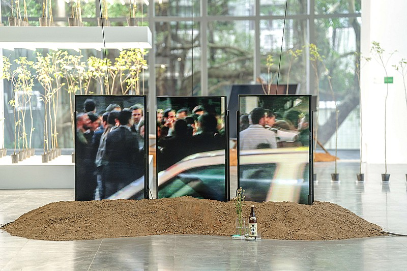

*Lee Tzu-Tung, "#GhostKeepers," Courtesy of MoNTUE. Photo by Wei-Cheng Huang.*

How easy is it to use RPi-Video-Sync-Looper for these two scenarios?

**If you want to set up a "single video loop playback" device:**：

1. Burn the pre-installed RPi-Video-Sync-Looper Raspbian image to an SD card and insert it into the Raspberry Pi.
2. Insert a USB flash drive containing a video file into the Raspberry Pi.
3. After powering on, RPi-Video-Sync-Looper will continuously loop your video.

**If you want to set up a "multi-screen synchronized video playback" system:**：

1. Burn the pre-installed RPi-Video-Sync-Looper Raspbian image to multiple SD cards.
2. Insert the SD cards into a USB card reader and read them on your computer.
3. Using a text editor, modify the RPi-Video-Sync-Looper configuration file on the SD cards to determine the role it will play in synchronized playback (this will be explained later).
4. Insert the SD cards and a USB flash drive with a video file into the Raspberry Pi.
5. Once you have configured the network environment and connected the display and audio cables, simply power on the Raspberry Pi, and it will run a synchronized playback system.

**No Linux operating knowledge is required.**。


## Key Features

- **Multi-Device Video Synchronization**: When multiple devices play different videos simultaneously, RPi-Video-Sync-Looper ensures that the playback progress of these videos remains synchronized.

- **Easy Configuration**: Use a simple configuration file to specify playback parameters. You don't need any Linux operating knowledge.

- **Open-Source**: RPi-Video-Sync-Looper is open-source software, and contributions to secondary development and collaboration are welcome.


## Build Guide


**Synchronized Playback Concept:**

To seup a synchronized playback system, you need to specify one devices as the "Master," and the others as "Slaves." All devices (Master and Slaves) must be connected to the same local area network. When the Master plays a video, it broadcasts its playback progress information over the local network. Each Slave receives this information and adjusts its own video playback progress based on the Master's progress, thereby achieving synchronized playback. Therefore, in the RPi-Video-Sync-Looper configuration, the only thing you need to confirm is whether each machine plays the role of Master or Slave.


**Device Used**：


The device used for the development and testing of RPi-Video-Sync-Looper is the [Raspberry Pi 3 Model B+](https://www.raspberrypi.com/products/raspberry-pi-3-model-b-plus/). The Raspberry Pi 4 can also run RPi-Video-Sync-Looper, but it requires the older Raspbian　release (will be mentioned later).


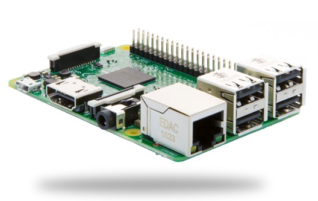


**The steps to build a multi-screen synchronized video playback system using RPi-Video-Sync-Looper are as follows:**：

1. Install the RPi-Video-Sync-Looper package for each Raspberry Pi participating in synchronized playback.
2. Modify the configuration file to determine whether each Raspberry Pi will play the role of Master or Slave.
3. Prepare a USB flash drive for each playback device and place the video file you want to play in the root directory (top-level directory) of the flash drive.
4. Connect all Raspberry Pis participating in synchronized playback to the same local area network. You may need a switch hub and network cables.
5. Connect the HDMI of the Raspberry Pi to a display. Sound can be output directly from the HDMI or through the 3.5mm audio jack to speakers.
6. Insert the USB flash drive containing the video file into the Raspberry Pi before powering it on.
7. Synchronized playback should begin within about 20 seconds.

The following provides detailed explanations for each step:


### 1. Install RPi-Video-Sync-Looper

You can install RPi-Video-Sync-Looper in two ways:

* Method 1: **(Recommended!!!)** Use the pre-installed RPi-Video-Sync-Looper Raspbian image.
* Method 2: Install the RPi-Video-Sync-Looper package in an existing Raspbian environment (requires Linux operation).


#### Method 1: Use the Pre-installed Raspbian Image with RPi-Video-Sync-Looper (Recommended)

1. Download the [rasbian-buster-videosync.img.gz](#latest-release) from Google Drive.
2. Use [balenaEtcher](https://etcher.balena.io/) to burn rasbian-buster-videosync.img.gz onto a micro SD card with a capacity of 8GB or more.

Using balenaEtcher is very simple. After opening it, click "Flash from file" and select the rasbian-buster-videosync.img.gz file. There's no need to unzip the image file in advance; balenaEtcher will automatically detect and decompress it during the burning process.

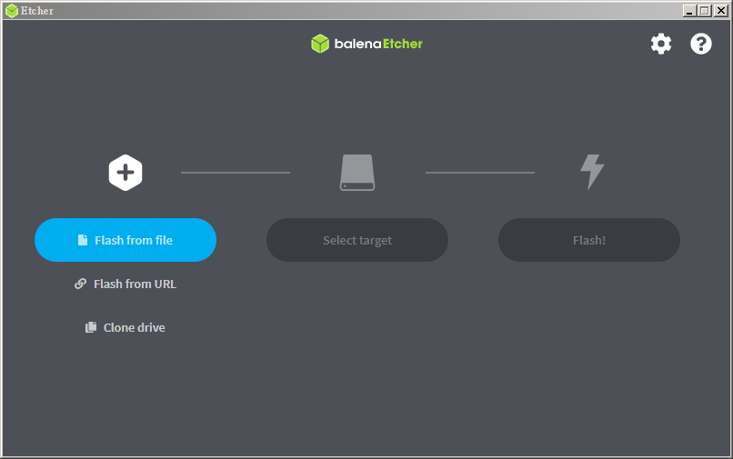

Click "Select target" to choose the target for the image.


Insert your SD card into your computer, and you should see a partition labeled "Mass Storage Device USB Device." Confirm that the partition size matches your USB drive size and select it.

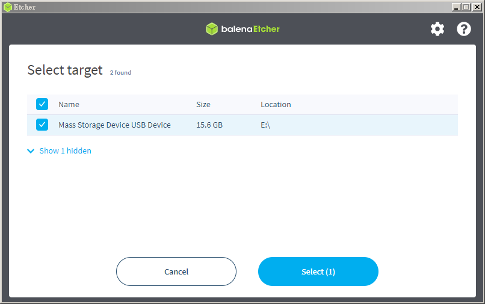

Finally, press "Flash" to start the burning process.

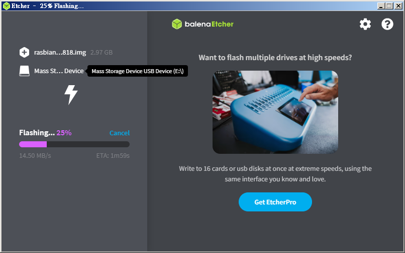

After a successful burn, the SD card will contain a Raspbian system that supports synchronized playback. 


#### Method 2: Installing RPi-Video-Sync-Looper Package in an Existing Raspbian Environment

This method requires Linux expertise and specific Raspbian distro requirements. Please make sure you are using `Raspbian Buster` (Debian 10). This project uses omxplayer as the video player, but newer versions of Raspbian (such as bullseye, bookworm, etc.) no longer support omxplayer.

The base Linux system used in this project comes from the official Raspberry Pi release, [2023-05-03-raspios-buster-armhf-lite.img.xz](https://downloads.raspberrypi.org/raspios_oldstable_lite_armhf/images/raspios_oldstable_lite_armhf-2023-05-03/). Raspbian typically releases two versions: a Lite version without X-window GUI (which is the chosen for this project) and a full version with a desktop environment (possibly labeled "full" in the filename). Generally, a Linux system with a desktop environment is not required. However, if you prefer to configure settings through a GUI, you can install the full version of Raspbian (e.g., [2023-05-03-raspios-buster-armhf.img.xz](https://downloads.raspberrypi.com/raspios_oldstable_armhf/images/raspios_oldstable_armhf-2023-05-03/)).

If you are already using Raspbian Buster, you can skip the step of burning the Raspbian image. Otherwise, after downloading raspios-buster-arm64-lite.zip, use [balenaEtcher](https://etcher.balena.io/) to flash the .zip to an SD card.


After Raspbian boots up, ensure your Raspberry Pi is connected to the internet. Then, execute the following commands:

First, install the necessary packages:

```
sudo apt update && \
sudo apt install -y omxplayer exfat-fuse exfat-utils python3 psmisc procps libpcre3 fonts-freefont-ttf fbset libssh-4 python3-dbus
```

Then run:

```
curl -LJs https://raw.githubusercontent.com/andrewintw/rpi-video-sync-looper/main/install.sh | sudo bash
```

The install.sh script will check if the required packages are installed, then download and install the necessary files to your Raspberry Pi's file system. The required files are located in the [rootfs/](rootfs/) directory of the Git repository. If you are familiar with Linux operations, you can also download and install them manually.


**Note!!!** By default, "Master" is the installed playback role. You can also specify the role (Master or Slave) during installation with the following commands:

To assign a device as Master, run the following installation command:

```
curl -LJs https://raw.githubusercontent.com/andrewintw/rpi-video-sync-looper/main/install.sh | sudo bash -s -- master
```

To assign a device as Slave, run the following installation command:

```
curl -LJs https://raw.githubusercontent.com/andrewintw/rpi-video-sync-looper/main/install.sh | sudo bash -s -- slave
```

Of course, you can also switch roles after installation by modifying the configuration file (see the next step).


### 2. Configure the video-sync.conf File

RPi-Video-Sync-Looper's configuration file is located in /boot and is named [video-sync.conf](rootfs/boot/video-sync.conf). If you are familiar with Linux operations, you can directly edit it using a text editor in your Raspberry Pi's terminal window:


```
sudo vi /boot/video-sync.conf
```

or

```
sudo nano /boot/video-sync.conf
```

If you are not familiar with Linux, you can first shut down the Raspberry Pi (using the `sudo poweroff` command or by turning off the power). After it's powered off, remove the SD card and connect it to your computer using a USB card reader (as shown below).


You'll find a partition named "boot". Inside that directory, you'll see the video-sync.conf file, which is the primary configuration file for RPi-Video-Sync-Looper.

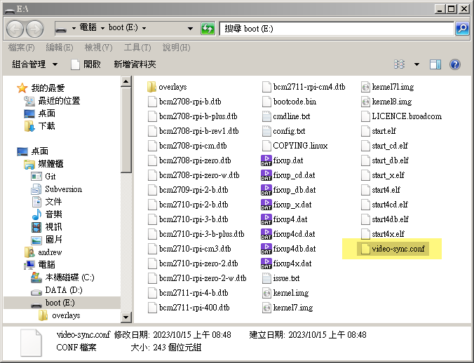

When using Master (the default), the video-sync.conf file looks like this:

```connfig
video.player=omxplayer
video.player.mode='sync_loop'
video.player.role='master'
video.player.loop='1'
video.player.verbose='0'
video.player.audiodev='both'
video.player.filepath='/media/USB'
video.player.ifname='eth0'
video.player.rundemo='0'
```

Some of the configuration items are designed for future work and aren't currently used. Here are some of the more critical settings and their explanations:

* **video.player.role**
	* Synchronization role
	* Can be set to `master` (default) or `slave`
* **video.player.loop**
	* Should it loop?
	* Can be set to `1` (loop) or `0` (play once)
* **video.player.audiodev**
	* Where should the audio output go?
	* Can be set to: hdmi / local / both (default)
* **video.player.filepath**
	* Where to find the video to be played
	* The default is `/media/USB`, which is the path where the USB drive is mounted on the system
* **video.player.rundemo**
	* Is it running in DEMO mode?
	* Can be set to `1` (yes) or `0` (no, default)
	* In DEMO mode, it will attempt to play "/home/pi/synctest.mp4"


### 3. Prepare USB Drive and Video File

In this step, there are three key things you need to ensure:

* Confirm the video file format - H.264
* Ensure the video file names are consistent
* Ensure the USB drive is formatted as exFAT


**Use H.264 Video Format**

[omxplayer](https://github.com/popcornmix/omxplayer) can play most video formats. To allow the system to automatically detect video files on your USB drive, RPi-Video-Sync-Looper currently only detects the following formats: `*.mp4`, `*.mkv`, `*.m4v`, `*.mov`, `*.avi`. [omxplayer-sync](https://github.com/turingmachine/omxplayer-sync) recommends using mp4 files encoded in H.264 format.

Additionally, the hardware used in this project is the Raspberry Pi 3 Model B+, which supports a maximum resolution of 1920x1080 (1080p/Full HD). If you need to use 2K or 4K resolutions, you'll need to test with Pi 4 or higher hardware.

According to the documentation of [OMXPlayer-Sync](https://github.com/turingmachine/omxplayer-sync), the video must be at least 60 seconds long.

**Consistent Video File Names**

The video files participating in synchronized playback must have the same file names. For example, if you are using three Raspberry Pi devices (one Master + two Slaves) for synchronized playback, the video files on the USB drives inserted into these three Raspberry Pi devices can have different content, but the "**file names must be the same**". For example, if the Master plays a video with the name GK5.mp4, the other two devices should also play a video named GK5.mp4. However, the size of the mp4 files played by these three devices may be different because their content is different.

Furthermore, the video files (e.g., GK5.mp4) should be placed **in the top-level folder of the USB drive**, not in subdirectories, as RPi-Video-Sync-Looper only searches for files in the top-level folder.


**Use exFAT**

The USB drive is used to store your video file (*.mp4). The USB drive must be formatted as exFAT, as shown in the image below.

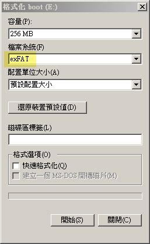


Inserting a USB drive with a format other than exFAT will result in a mounting error during the boot process, causing it to hang at this screen:

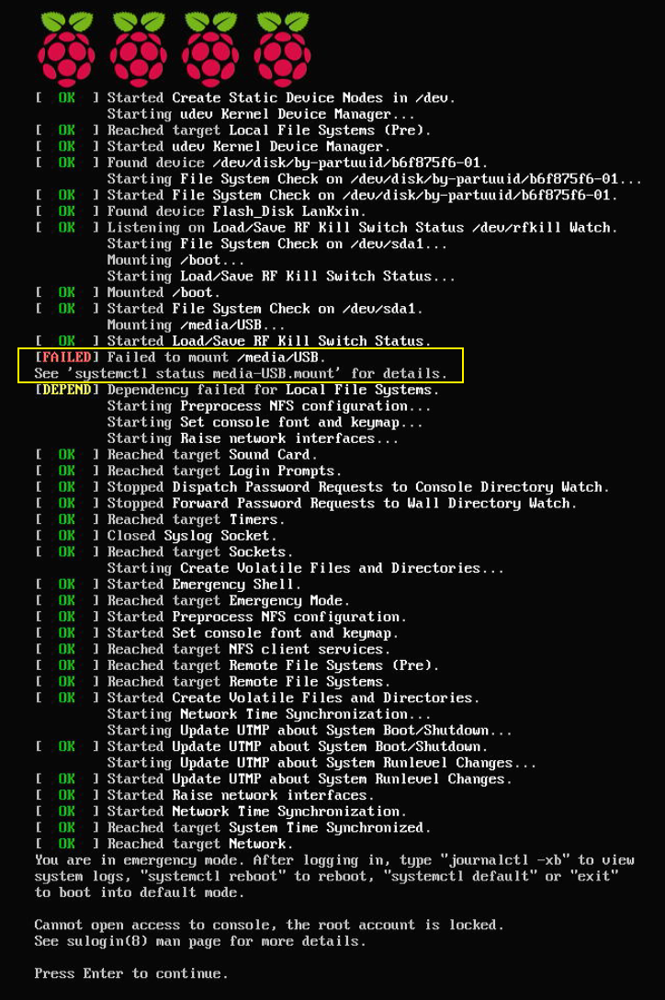


### 4. Network Setup

As mentioned earlier, synchronized playback requires operation within a local area network. The recommended method is to connect all Raspberry Pi devices to a WiFi router's LAN ports, as shown in the diagram below.

```
  +---------------+
  |  WiFi Router  |
  +-----+---------+　　<<< wireless >>> [control/monitor laptop]
  | WAN |   LAN   |
  +-----+---------+
          | |...|
          | |   +----(ethernet/wireless)----[video-sync: SlaveN]---(hdml)---[monitor]
          | +--------(ethernet/wireless)----[video-sync: Slave1]---(hdml)---[monitor]
          +----------(ethernet/wireless)----[video-sync: Master]---(hdml)---[monitor]
```

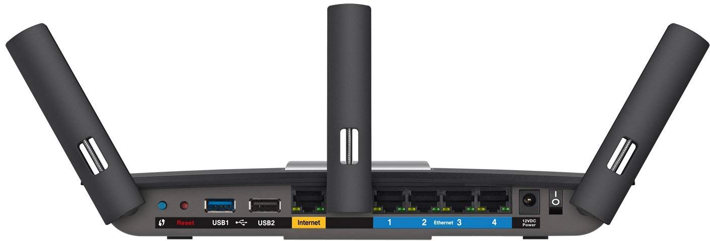

This approach offers several advantages:

* **Automatic IP Address Assignment**: The WiFi router automatically assigns IP addresses to all Raspberry Pi playback devices connected to it, eliminating the need for manual configuration.
* **Network Isolation**: All devices participating in synchronized playback are on a separate local network, making them less susceptible to interference from the venue's network, even if the router's WAN port is connected to the venue's network.
* **Easy Remote Maintenance**: You can remotely control all playback devices below the router by wirelessly connecting your laptop to the WiFi router.
* **Connection to Venue Network**: By connecting the WiFi router to the venue's network, you can enable all playback devices to access the internet.

Additionally, you can connect all devices participating in synchronized playback wirelessly to the WiFi router to create a "wireless local area network." However, if you have the option to use wired Ethernet connections during the setup, it may provide more stability.

**What If You Don't Have a WiFi Router?**

Since the synchronized playback mechanism relies on Slave devices receiving synchronization information from the Master, using a Switch Hub is also possible if you don't have a WiFi router, as shown in the diagram below:

```
                          +---------------+
                          |  Switch Hub   |
                          +---------------+
                          |     Ports     |
                          +---------------+
                             |     | |...|
 [control/monitor laptop]----+     | |   +----(ethernet/wireless)----[video-sync: SlaveN]---(hdml)---[monitor]
                                   | +--------(ethernet/wireless)----[video-sync: Slave1]---(hdml)---[monitor]
                                   +----------(ethernet/wireless)----[video-sync: Master]---(hdml)---[monitor]
```

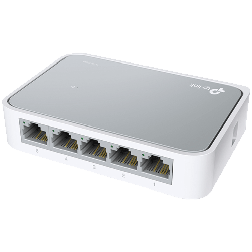

Switch Hubs do not have a distinction between WAN/LAN. By default, all devices under the Switch Hub do not assign IP addresses. Therefore, unless you manually configure IP addresses for each device, you cannot establish individual connections.

If you don't care about remote control capabilities, synchronized playback can still work (according to test results) without manually configuring IP addresses for each playback device. However, from a maintenance perspective, it's recommended to set static IP addresses for each playback device. You'll need to refer to the Raspberry Pi's manual for setting static IP addresses.


**SSH Connection**

SSH is a commonly used communication protocol for managing network devices. If you are using a Raspbian OS with RPi-Video-Sync-Looper pre-installed, your system has already enabled the SSH service. If you're operating your own Raspbian OS, you will need to refer to the Raspberry Pi manual to enable the SSH service for each playback device. Of course, if you prefer to configure or maintain your devices by connecting a keyboard directly to them, you may not need to use the SSH service.

Furthermore, the default username/password for SSH login to Raspberry Pi is still `pi/raspberry`. For security reasons, you may want to change the password or use key-based authentication.


### 5. Audio Output Configuration

By default, each Raspberry Pi device participating in synchronized playback will output audio simultaneously through both HDMI and the 3.5mm headphone jack.

In general, during synchronized playback, you only need a single primary audio source (because all audio should be the same). If your monitor already has built-in speakers, you can choose not to use external speakers and let the sound come directly from the monitor.

In most cases, artists may prefer to control the direction of sound propagation in the exhibition, so in most cases, sound is still output through external speakers.You can mute the monitor and select one of the playback devices as the audio output device, connecting the speakers to the device's 3.5mm headphone jack. Illustrated as follows:

```
  +---------------+
  |  WiFi Router  |
  +---------------+              +---------(3.5mm audio cable)---[speaker]
     | |...|                     |
     | |   +--------[video-sync: SlaveN]---(hdml)---[monitor]
     | +------------[video-sync: Slave1]---(hdml)---[monitor]
     +--------------[video-sync: Master]---(hdml)---[monitor]
```

Note: When wiring, you should pay attention to power supply. When too many monitors and devices operate simultaneously, you should avoid overheating.


### 6. Power-On Startup Process

The only thing you need to be aware of is that **you must insert the USB flash drive before powering on**. If you don't insert the USB flash drive, the boot process will get stuck at this screen:

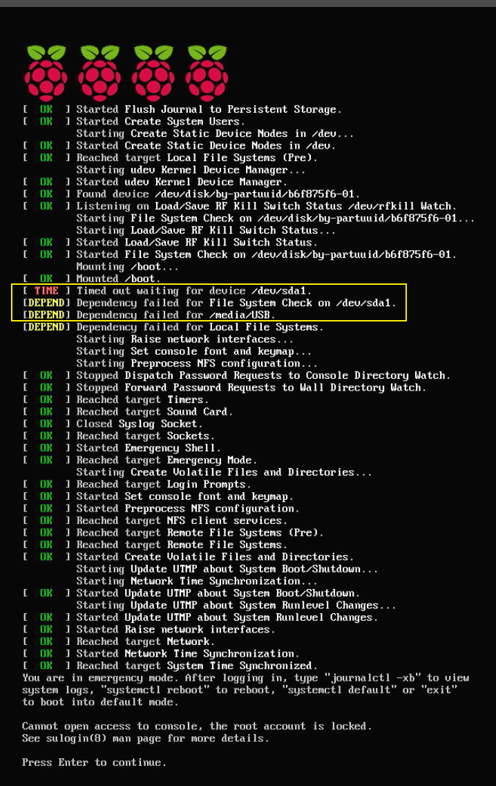


## Common Operations

RPi-Video-Sync-Looper is designed for artists and creators for exhibitions. The most common tasks during an exhibition are usually "replacing videos" and "changing synchronization roles."


### To Replace the Playback Videos (USB Flash Drive)

The SD card contains the Raspberry Pi's customized operating system, and the USB flash drive is where video files are stored. To replace videos:

1. **Power off the device** (never forcibly remove the USB flash drive while it's running).
2. Insert the USB flash drive into your computer and replace the video file.
3. Insert the USB flash drive back into the playback device.
4. Power on the playback device.


### To Switch Between Master/Slave Roles (SD Card)

To switch between Master and Slave roles, you need to modify the video-sync.conf configuration file, which is located on the SD card. Here's how you can do it:

If you're familiar with Linux commands, you can remotely connect to the playback device and edit the configuration file using the following command:

```
sudo vi /boot/video-sync.conf
```

or

```
sudo nano /boot/video-sync.conf
```

Alternatively, you can do it as follows:

1. **Power off the device** (never forcibly remove the SD card while it's running).
2. Remove the SD card and connect it to your computer using a USB card reader.
3. Open the "boot" partition and find the video-sync.conf configuration file.
4. Edit it using a text editor you're familiar with (e.g., Notepad or Notepad++).
5. After editing, insert the SD card back into the device and power it on.


The contents of the video-sync.conf file will look like this:

```connfig
video.player=omxplayer
video.player.mode='sync_loop'
video.player.role='master'    # <= Change this
video.player.loop='1'
video.player.verbose='0'
video.player.audiodev='both'
video.player.filepath='/media/USB'
video.player.ifname='eth0'
video.player.rundemo='0'
```

To operate as a Master, set:

```
video.player.role='master'
```

To operate as a Slave, set:

```
video.player.role='slave'
```


## Special Thanks

Special thanks to these giants who provided technical insights:

* [RPi_SyncLooper](https://github.com/HsienYu/RPi_SyncLooper) (HsienYu Cheng)
* [omxplayer-sync](https://github.com/turingmachine/omxplayer-sync) (Simon Josi)

Thanks to artist (and muse) [LEE Tzu-Tung](https://www.tzutung.com/) for providing inspiration and implementation opportunities.

Thanks to [Honki](https://www.facebook.com/honki) for promotion and [DAC.Taipei](https://dac.taipei/) for sponsorship.

## Contributions & Contact

Artists and creators are welcome to contact me with any ideas, needs, or bug reports related to this project. Contributions from the open-source community are also appreciated. You can open a topic for discussion via the [New issue](https://github.com/andrewintw/rpi-video-sync-looper/issues) feature.


## Licensing

The source code of this project is open-sourced under the [Mozilla Public License 2.0 (MPL 2.0)](LICENSE), while the documentation is shared under the [CC BY-SA 4.0 DEED](https://creativecommons.org/licenses/by-sa/4.0/deed.zh-hant).

RPi-Video-Sync-Looper wishes you a pleasant exhibition experience! :D
