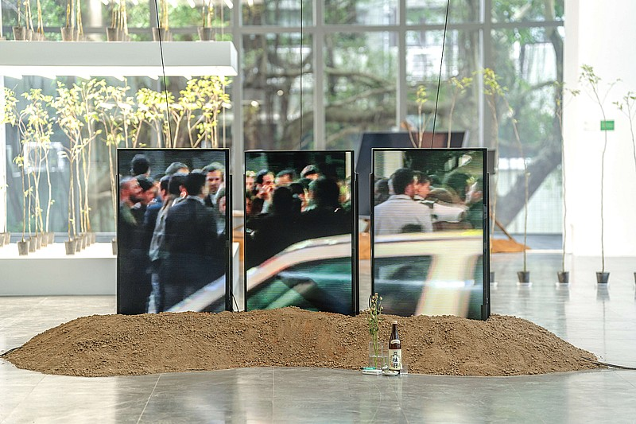
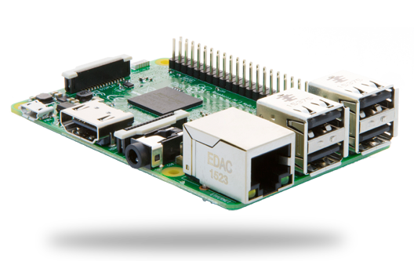
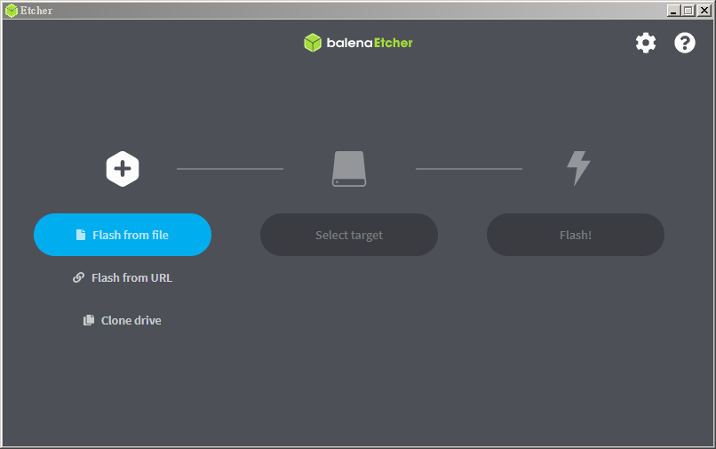
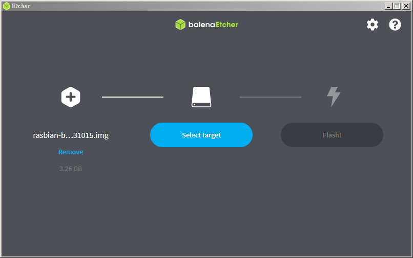
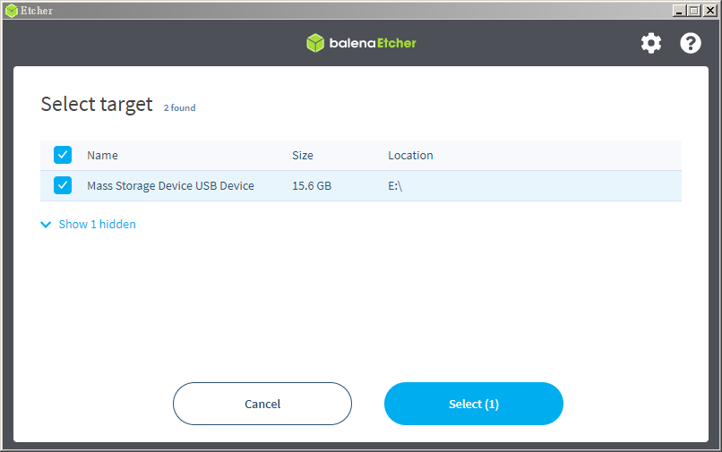
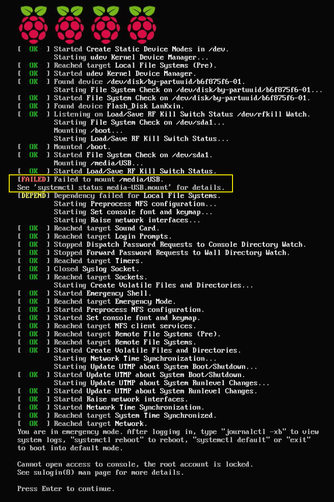
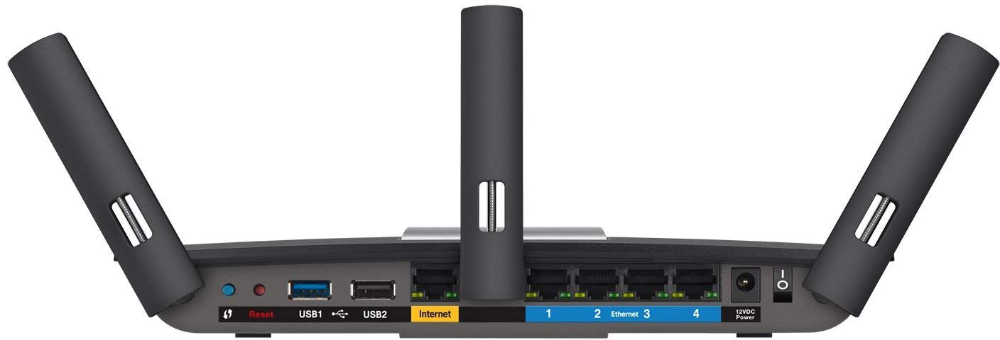

# RPi-Video-Sync-Looper

[更新日誌](CHANGELOG.md) | [工作坊投影片](docs/2023-12-02-workshop-DAC-Taipei.pdf)

**RPi-Video-Sync-Looper**（樹莓派影片同步循環播放器）是一個「針對藝術家和創作者」設計的開源播放器，專為樹莓派（Raspberry Pi）裝置打造。它允許多台樹莓派裝置各自播放不同的影片，同時確保這些影片的播放時間軸同步。無論是建置數位藝術裝置、展場影音播放，或是進行任何需要實現多螢幕影片同步播放的專案，RPi-Video-Sync-Looper 都能協助藝術家快速建置播放系統。

這份文件將說明 RPi-Video-Sync-Looper 可以做什麼，以及如何快速地將它應用於您的創作中，此文件不會涉及太多技術性的細節。

註：在這份文件中，若提到「播放設備」，指的是使用樹莓派搭載 RPi-Video-Sync-Looper 套件後的播放裝置。


## 應用場景

目前主要的應用為：

* 藝術展覽現場常見的「單一影片循環撥放」應用
* 「多螢幕影片同步播放」的藝術作品，例如：藝術家[李紫彤（LEE Tzu-Tung）](https://www.tzutung.com/)的作品《[#迎靈者（#Ghostkeepers）](https://www.facebook.com/GhostKeepers)》



*李紫彤，〈#迎靈者〉，北師美術館提供，攝影｜黃暐程*


使用 RPi-Video-Sync-Looper 有多簡單？針對以上的兩種應用場景：

**若您要設置「單一影片循環撥放」裝置**：

1. 將預裝 RPi-Video-Sync-Looper 的 Raspbian 映像檔燒錄至 SD 卡後插入樹莓派
2. 將含有影片檔的 USB 隨身碟插入樹莓派
3. 上電後 RPi-Video-Sync-Looper 就會不斷循環播放您的影片

**若您要設置「多螢幕影片同步播放」系統**：

1. 將預裝 RPi-Video-Sync-Looper 的 Raspbian 映像檔燒錄至多張 SD 卡
2. 分別將 SD 卡以 USB 讀卡機卡在個人電腦中讀取
3. 以文字編輯器位於 SD 卡內的 RPi-Video-Sync-Looper 設定檔，即可決定在同步播放時所扮演的角色（稍後會說明）
4. 將 SD 卡以及含有影片檔的 USB 隨身碟分別插入樹莓派
5. 配置好網路環境和連接好顯示、聲音的線路後，上電後即可自成一個同步播放系統

重要的是：**您無須具備任何 Linux 操作知識**。


## 功能特色

- **多裝置影片同步播放**：當多樹莓派同時播放不同的影片時，RPi-Video-Sync-Looper 能確保這些影片的播放進度保持同步。

- **簡單配置**：使用簡單的配置文件來指定播放參數。您無須具備任何 Linux 操作知識。

- **開源軟體**：RPi-Video-Sync-Looper 是開源軟體，歡迎各種二次開發與協作貢獻。


## 建構指南


**同步播放概念**：

要運作同步播放系統，需要在一組播放設備中，指定其中一台作為播放主機（Master）的角色，其餘的設備則為從機（Slave）。所有設備（Master 以及 Slaves）必須連接到同一個區域網路。Master 在播放影片時會向區域網路廣播其播放進度資訊，每個 Slave 都會接收這些資訊，然後根據 Master 的播放進度來調整自己的影片播放進度，藉此實現同步播放功能。因此，在 RPi-Video-Sync-Looper 的軟體設定中，您唯一需要確認的設定項目，就是設定每台機器扮演 Master 或是 Slave 的角色。


**使用設備**：

RPi-Video-Sync-Looper 開發與測試時所使用的樹莓派版本為 [Raspberry Pi 3 Model B+](https://www.raspberrypi.com/products/raspberry-pi-3-model-b-plus/)，這也是目前台灣各大美術館展演空間可能會備有的版本。後繼的 Raspberry Pi 4 亦可運作 RPi-Video-Sync-Looper，但是需要使用舊的 buster 發行版（將在後面提到）。




**使用 RPi-Video-Sync-Looper 建構一個多螢幕影片同步播放系統的步驟如下**：

1. 替每一個參與同步播放的樹莓派都安裝 RPi-Video-Sync-Looper 套件
2. 修改設定檔，決定每一台樹莓派扮演 master 或 slave 角色
3. 替每個樹莓派播放設備準備一個 USB 隨身碟，將欲播放的影片檔案放在隨身碟的根目錄（最上層目錄）
4. 將所有參與同步播放的樹莓派透過網路接入同一個區域網路。你可能會需要 switch hub 和網路線
5. 將樹莓派的 HDMI 接入顯示器。聲音可直接從 HDMI 輸出，或是透過 3.5mm 的音源孔輸出到揚聲器
6. 先將含有影片檔的 USB 隨身碟插入樹莓派，然後才上電開機
7. 上電後約 20 秒左右，應該會啟動同步播放

以下是各步驟的詳細說明：

### 1. 安裝 RPi-Video-Sync-Looper

安裝 RPi-Video-Sync-Looper 的方式有兩種：

* 方法一：**（建議方式!!!）** 使用預裝 RPi-Video-Sync-Looper 的 Raspbian 映像檔
* 方法二：於現有的 Raspbian 環境中安裝 RPi-Video-Sync-Looper 套件（需要操作 Linux）


#### 方法一：使用預裝 RPi-Video-Sync-Looper 的 Raspbian 映像檔（建議方式）

1. 下載 [rasbian-buster-videosync.img.gz](https://drive.google.com/file/d/1Ja70rtXkPDeGQ3Hvx1uGSTM6tNpmpyOp/view?usp=share_link)（Google 雲端硬碟）
2. 使用 [balenaEtcher](https://etcher.balena.io/) 將 rasbian-buster-videosync.img.gz 燒錄至 8GB 大小以上的 micro SD 卡。

balenaEtcher 的操作方法非常簡單，開啟後點選「Flash from file」，然後選擇 rasbian-buster-videosync.img.gz。不需要事先解壓縮映像檔，燒錄軟體會在燒錄時自動偵測並解壓縮。



點選「Select target」選擇映像檔要燒錄的目的地。



將 SD 卡插入電腦，應該會看見標示為 `Mass Storage Device USB Device` 的磁區。確認磁區大小與你的隨身碟大小一致後勾選它。



最後按下「Flash」就開始燒錄了。


燒錄成功後，SD 卡裡面就是一個支援同步播放的 Raspbian 系統。 

#### 方法二：於現有的 Raspbian 環境中安裝 RPi-Video-Sync-Looper 套件

這個方式需要操作 Linux，並且對 Raspbian 的版本有要求：請務必使用 `Raspbian Buster` 的版本（Debian 10）。本專案中用來撥放影片檔的撥放器為 omxplayer，而 Raspbian Buster 的後繼版本（bullseye, bookworm 等）在架構上已不再支援 omxplayer。

本專案所使用的 base Linux，是來自 Raspberry Pi 官方釋出的 [2023-05-03-raspios-buster-armhf-lite.img.xz](https://downloads.raspberrypi.org/raspios_oldstable_lite_armhf/images/raspios_oldstable_lite_armhf-2023-05-03/)。通常 Raspbian 會釋出兩個版本：一個是不含 X-window 視窗環境的 Lite 版本（也正是本專案所選擇的）；另一個是包含視窗環境的桌面版本（可能會在檔名標示 "full"）。原則上您無需使用任何帶視窗環境的 Raspbian 發行版，但如果您更喜歡透過視窗環境進行設定檔的修改，或是一些諸如網路設定的操作，那麼也是可以選擇安裝完整版的 Raspbian（ex: [2023-05-03-raspios-buster-armhf.img.xz](https://downloads.raspberrypi.com/raspios_oldstable_armhf/images/raspios_oldstable_armhf-2023-05-03/)）

如果您已經在使用 Raspbian Buster，則可忽略燒錄 Raspbian 映像檔的步驟，否則請於下載 raspios-buster-arm64-lite.zip 後，使用 [balenaEtcher](https://etcher.balena.io/) 將 .zip 燒錄至 SD 卡中。

Raspbian 開機完成後，確認您的樹莓派已經連線至網際網路。然後執行以下的指令：

先安裝必要的套件：

```
sudo apt update && \
sudo apt install -y omxplayer exfat-fuse exfat-utils python3 psmisc procps libpcre3 fonts-freefont-ttf fbset libssh-4 python3-dbus
```

然後執行：

```
curl -LJs https://raw.githubusercontent.com/andrewintw/rpi-video-sync-looper/main/install.sh | sudo bash
```

install.sh 會檢查相依的套件是否已經安裝，接著將所需的檔案下載並安裝至您的樹莓派裝檔案系統中。安裝所需的檔案放在 git 檔案庫的 [rootfs/](rootfs/) 目錄下，如果您熟悉 Linux 的操作，也可以自行下載安裝。

**注意！！！** "Master" 是預設安裝的播放角色。您也可以使用以下的安裝指令，於安裝時決定好播放角色（Master or Slave）。

若要將設備指派為 Master，請執行以下指令進行安裝：

```
curl -LJs https://raw.githubusercontent.com/andrewintw/rpi-video-sync-looper/main/install.sh | sudo bash -s -- master
```

若要將設備指派為 Slave，請執行以下指令進行安裝：

```
curl -LJs https://raw.githubusercontent.com/andrewintw/rpi-video-sync-looper/main/install.sh | sudo bash -s -- slave
```

當然，也可以在安裝後再透過修改設定檔的方式切換角色（請參見下一個步驟）。


### 2. 配置設定檔 video-sync.conf

RPi-Video-Sync-Looper 的設定檔位於 /boot 下的 [video-sync.conf](rootfs/boot/video-sync.conf)。如果您熟悉 Linux 的操作，可在樹莓派的終端視窗中直接以文字編輯器編輯它：

```
sudo vi /boot/video-sync.conf
```

或

```
sudo nano /boot/video-sync.conf
```

如果您不熟悉 Linux，可以先將樹莓派關機（使用指令 `sudo poweroff`或是直接關閉電源）。關機後將 SD 卡取出，透過 USB 讀卡機（下圖）接入電腦。


您將可以在檔案總管中看見名為 `boot` 的磁區。目錄內的 video-sync.conf 就是 RPi-Video-Sync-Looper 的主要設定檔。


使用 Master（預設）情況下，video-sync.conf 的內容如下：

```connfig
video.player=omxplayer
video.player.mode='sync_loop'
video.player.role='master'
video.player.loop='1'
video.player.verbose='0'
video.player.audiodev='both'
video.player.filepath='/media/USB'
video.player.ifname='eth0'
video.player.rundemo='0'
```

有些設定項目是為了未來的規劃而設計的，目前用不到。以下是比較重要的設定及其說明：

* **video.player.role**
	* 同步播放角色
	* 可接受的設定為 `master`（預設）或 `slave`
* **video.player.loop**
	* 是否循環播放？
	* 可接受的設定為 `1`（循環）或 `0`（僅播放一次）
* **video.player.audiodev**
	* 聲音往哪輸出？
	* 可接受的設定為：hdmi/local/both（預設）
* **video.player.filepath**
	* 從哪個路徑下尋找欲播放的影片檔
	* 預設是 `/media/USB` 這個路徑即是 USB 隨身碟掛載到系統的路徑
* **video.player.rundemo**
	* 是否運作於 DEMO 模式？
	* 可接受的設定為 `1`（是）或 `0`（否，預設）
	* DEMO 模式下會嘗試播放 `/home/pi/synctest.mp4`


### 3. 準備 USB 隨身碟與播放檔案

在這個步驟中，您唯一要確認的三件事情是：

* 確認影片檔案的格式 -- H.264
* 確認影片的檔名一致
* 確認隨身碟的格式化類型 -- exFAT


**使用 H264 影片格式**

影片格式方面，原則上 [omxplayer](https://github.com/popcornmix/omxplayer) 能夠播放的影片格式都支援。為了讓系統自動偵測 USB 內的播放檔，目前 RPi-Video-Sync-Looper 僅偵測：`*.mp4`, `*.mkv`, `*.m4v`, `*.mov`, `*.avi` 這幾種格式。[omxplayer-sync](https://github.com/turingmachine/omxplayer-sync) 建議的格式是使用 H.264 編碼的 mp4 檔案。

另外，本專案所使用的硬體是 Raspberry Pi 3 Model B+，3B+ 版本支援的最高解析度為 1920x1080（1080p/Full HD）。若您需要使用到 2K 甚至 4K 的解析度，需要使用 Pi 4 以上的硬體進行測試。


**所有影片檔名一致**

參與同步播放的影片檔名都需要一致。假如透過三台樹莓派（一台 Master + 兩台 Slave）進行同步播放。這三台樹莓派所插入的 USB 隨身碟中的影片檔的內容可以不一樣，但是「檔名都需要取一樣的名字」。例如 Master 播放的檔名若是 GK5.mp4，則另外兩台播放的檔名也需要是 GK5.mp4，但是這三台設備所播放的 mp4 檔案的大小可能是不同的（因為它們的內容是不同的）。

此外，影片檔（ex: GK5.mp4）請放置在隨身碟的**最上層資料夾中**，切勿放置於子目錄中，RPi-Video-Sync-Looper 只會嘗試搜尋最上層的資料夾。

**使用 exFAT**

USB 隨身碟是用來放置您的撥放影片的（*.mp4）。隨身碟必須被格式化為 exFAT（如下圖）。


插入一個非 exFAT 格式的 USB 隨身碟，會在開機嘗試掛載 USB 隨身碟的過程中出現掛載錯誤的訊息，並卡在這個畫面：




### 4. 網路環境設定

如同前面提到的，同步播放機制需要運作在一個區域網路內。我所推薦的方法是：將所有樹莓派接到一台 WiFi 路由器的 LAN 端，示意圖如下。

```
  +---------------+
  |  WiFi Router  |
  +-----+---------+　　<<< wireless >>> [control/monitor laptop]
  | WAN |   LAN   |
  +-----+---------+
          | |...|
          | |   +----(ethernet/wireless)----[video-sync: SlaveN]---(hdml)---[monitor]
          | +--------(ethernet/wireless)----[video-sync: Slave1]---(hdml)---[monitor]
          +----------(ethernet/wireless)----[video-sync: Master]---(hdml)---[monitor]
```



這樣做有幾個好處：

* **自動分配 IP 位址**：WiFi 路由器會自動分配 IP 給底下所有的樹莓派播放裝置，無須一一手動設定
* **具有網路隔離性**：所有參與同步播放的裝置都位於獨立的區域網路，就算路由器的 WAN 接入館方的網路，也不容易受到館方網路的影響
* **容易進行遠端維護**：只需使用筆電無線連接至 WiFi 路由器，就可以遠端控制路由器下方的所有播放設備
* **可連結館方網路**：您可以透過讓 WiFi 路由器連接館方的網路，來讓所有播放設備能連結網際網路

另外，原則上您可以透過設定，讓所有的參與同步播放的設備，皆以無線連線的方式連接入 WiFi 路由器，形成一個 "無線區域網路"，但如果在布展時能使用有線網路的方式走線會比較穩定。


**如果沒有 WiFi 路由器？**

由於同步播放機制的重點在於讓 Slave 裝置收到 Master 發送的同步資訊。因此如果沒有 WiFi 路由器，使用一般的集線器（Switch Hub）也是可以的，示意圖如下：

```
                          +---------------+
                          |  Switch Hub   |
                          +---------------+
                          |     Ports     |
                          +---------------+
                             |     | |...|
 [control/monitor laptop]----+     | |   +----(ethernet/wireless)----[video-sync: SlaveN]---(hdml)---[monitor]
                                   | +--------(ethernet/wireless)----[video-sync: Slave1]---(hdml)---[monitor]
                                   +----------(ethernet/wireless)----[video-sync: Master]---(hdml)---[monitor]
```


Switch Hub 並沒有 WAN/LAN 的區別，在預設情況下由於 Switch Hub 底下的所有裝置都無配發 IP 位址的功能，因此除非一一手動設定所有裝置的 IP 位址，否則無法對個別裝置進行連線控制。

若您不在乎是否能進行連線控制，則（根據測試結果）無需替任何播放裝置設定 IP 位址，同步播放也是可以運作的。但從維護的角度來看，還是建議替每個播放設備設定固定 IP 位址。您需要參考樹莓派的手冊，替每台設備設定靜態 IP 位址（Static IP Address）。


**ssh 連線**

ssh 是管理網路設備常用的通訊協定。如果您使用的是已預裝 RPi-Video-Sync-Looper 的 Raspbian 系統，則您的系統已啟用 ssh 服務。如果您運作自己的 Raspbian 系統，則需要參考樹莓派的手冊替每個播放設備開啟 ssh 服務。當然，如果您願意透過 "直接將鍵盤接上樹莓派" 進行設定或維護工作，那麼或許就不需要使用 ssh 服務。

此外，以 ssh 登入樹莓派的帳號/密碼，仍是預設的 pi/raspberry。為了安全性，您可能會希望自行修改密碼，或是使用金鑰的方式認證。


### 5. 影音輸出設置

預設情況下，每一台參與同步播放的樹莓派裝置，都會將聲音「同時」由 HDMI 以及 3.5mm 的耳機孔輸出。

「理論上」同步播放時，只需要有一個主要音源輸出即可（因為同步播放時，所有聲音應該是一樣的）。如果顯示器已經內建揚聲器，可以選擇不外接揚聲器，直接讓聲音從螢幕輸出。

大多數情況下，藝術家會希望能控制聲音在展場的傳播方向，所以多數情況仍是透過外接揚聲器輸出聲音的。這個時候可以將螢幕切換為靜音模式。然後選擇任何一台播放設備當作聲音輸出裝置，並將揚聲器接入該設備的 3.5mm 耳機孔。示意如下：

```
  +---------------+
  |  WiFi Router  |
  +---------------+              +---------(3.5mm audio cable)---[speaker]
     | |...|                     |
     | |   +--------[video-sync: SlaveN]---(hdml)---[monitor]
     | +------------[video-sync: Slave1]---(hdml)---[monitor]
     +--------------[video-sync: Master]---(hdml)---[monitor]
```

注意：在布線時要注意的是電源的供應，當播放系統中有太多螢幕和設備同時運作時，要做適度的分流，避免過熱。


### 6. 上電啟動流程

您唯一需要注意的是：**必須先插入 USB 隨身碟，然後才上電**。如果沒有插入 USB 隨身碟，開機後會卡在這個畫面：


## 常用操作

RPi-Video-Sync-Looper 是設計給藝術家和創作者布展使用的。通常在布展期間最常做的事情就是「替換影片」以及「替換同步角色」。


### 想要替換播放的影片（USB 隨身碟）

SD 卡存放的是樹莓派的客製化作業系統，而 USB 隨身碟才是存放影片檔的位置。想要替換影片時：

1. **裝置斷電**（切勿在運作時強制移除 USB 隨身碟）
2. 將 USB 隨身碟插入電腦，替換新的影片檔（注意檔名要一致）
3. 將 USB 隨身碟插回播放裝置
4. 將播放裝置上電


### 想要切換 Master/Slave 角色（SD 卡）

想要切換 Master/Slave 角色時，需要修改設定檔 video-sync.conf。而設定檔所在的位置是系統資料夾內，因此位於 SD 卡內。

如果您熟悉 Linux 指令，可以透過遠端連線至播放裝置，然後使用指令編輯設定檔

```
sudo vi /boot/video-sync.conf
```

或

```
sudo nano /boot/video-sync.conf
```

或是簡單使用以下的方式：

1. **裝置斷電**（切勿在運作時強制移除 SD 卡）
2. 將 SD 卡取出並透過 USB 讀卡機接入電腦
3. 開啟「boot」的磁區。找到設定檔 video-sync.conf
4. 使用您熟悉的文字編輯編輯（ex: 記事本或 Notepad++）
5. 編輯完後將 SD 卡插回裝置開機


video-sync.conf 的檔案內容如下：

```connfig
video.player=omxplayer
video.player.mode='sync_loop'
video.player.role='master'    # <= 改這行
video.player.loop='1'
video.player.verbose='0'
video.player.audiodev='both'
video.player.filepath='/media/USB'
video.player.ifname='eth0'
video.player.rundemo='0'
```

若要以 Master 運作，請設定

```
video.player.role='master'
```

若要以 Slave 運作，請設定

```
video.player.role='slave'
```


## 特別感謝

感謝這些提供「技術肩膀」的巨人們

* [RPi_SyncLooper](https://github.com/HsienYu/RPi_SyncLooper) (HsienYu Cheng 鄭先喻)
* [omxplayer-sync](https://github.com/turingmachine/omxplayer-sync) (Simon Josi)

感謝提供靈感和實作機會的藝術家[李紫彤](https://www.tzutung.com/)

感謝[鄭鴻旗](https://www.facebook.com/honki)的推廣與 [DAC.Taipei臺北數位藝術中心](https://dac.taipei/) 的贊助


## 貢獻＆聯絡

若藝術家或創作者對此專案有任何想法、需求或錯誤回報，可隨時與我聯繫。亦歡迎任何開源社群的貢獻。您可透過 [New issue](https://github.com/andrewintw/rpi-video-sync-looper/issues) 功能開啟一個主題討論。

若您願意給予贊助，請前往[這裡](https://github.com/andrewintw/donate)查看資訊，非常感激。


## 授權

本專案程式碼的部分依據 [Mozilla 公眾授權條款 2.0（Mozilla Public License 2.0）](LICENSE)授權方式開源；文件的部分可依據 [CC BY-SA 4.0 DEED](https://creativecommons.org/licenses/by-sa/4.0/deed.zh-hant) 分享。


RPi-Video-Sync-Looper 祝您布展愉快 :D
